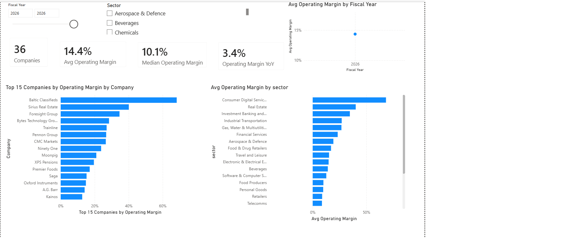
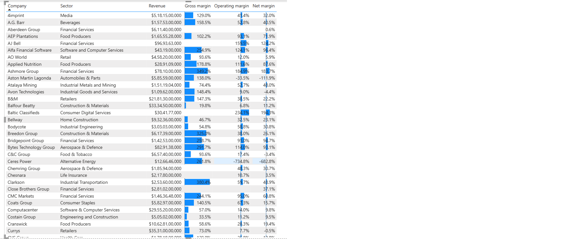

# FTSE 250 margin tracker

An open-source pipeline that tracks profit margins across the FTSE 250, refreshed
automatically from published financials and visualised in Power BI.
-----------------------------------------------------------------------------------
 
 
Every operating company in the index gets its gross, operating and net margin
computed from its annual income statement. A GitHub Action re-pulls the numbers
every week and commits the updated data, so the dashboard is always current
without anyone touching it.

## What it answers

- Which FTSE 250 companies run the fattest and thinnest margins.
- How margins compare across sectors.
- How a company's margin is trending year on year.

## How it works

```
Yahoo Finance income statements
        │   (src/fetch_margins.py)
        ▼
data/margins_history.csv   long format, one row per company per year
data/margins_latest.csv    most recent year per company
        │   (raw GitHub URL)
        ▼
Power BI dashboard          see powerbi/POWERBI_GUIDE.md
```

The weekly refresh is a GitHub Action (`.github/workflows/refresh.yml`). It runs
the fetch, recomputes every margin, and commits the CSVs. Power BI reads those
CSVs straight from the raw GitHub URL, so a single Refresh pulls the latest data.

## Design decisions

A few deliberate choices, because how you scope the data is the analysis:

- **Funds are excluded.** Roughly 99 of the 250 members are investment trusts,
  REITs or similar. They have no operating margin, so including them would make
  the comparison meaningless. They are flagged `is_fund` in
  `data/constituents.csv` and skipped by default. Pass `--include-funds` to keep
  them.
- **Margins, not absolute profit.** A margin is a ratio, so it is comparable
  across companies that report in different currencies (some FTSE 250 names
  report in USD or EUR). Currency is recorded alongside each row for reference.
- **Missing lines are left blank, not zero.** Banks and some financials have no
  gross-profit line. The pipeline records a blank rather than a misleading 0%.
- **Constituents are versioned.** The index is reviewed quarterly.
  `src/update_constituents.py` refreshes the member list from the official
  source so the tracker stays accurate.

## Quickstart

```
pip install -r requirements.txt
python src/build_constituents.py         # builds data/constituents.csv
python src/fetch_margins.py --limit 15   # quick test on 15 companies
python src/fetch_margins.py              # full run, 151 operating companies
```

Then follow `powerbi/POWERBI_GUIDE.md` to build the dashboard.

Run the offline test (no internet needed) to check the margin logic:

```
python tests/test_transform.py
```

## Repository layout

```
ftse250-margins/
├── data/
│   ├── constituents_raw.tsv     source list (name, ticker, sector)
│   ├── constituents.csv         built list with Yahoo tickers and fund flag
│   ├── margins_history.csv      output: margins by company by year
│   └── margins_latest.csv       output: most recent year per company
├── src/
│   ├── build_constituents.py    raw list -> constituents.csv
│   ├── update_constituents.py   refresh the member list from Wikipedia
│   └── fetch_margins.py         pull income statements, compute margins
├── tests/
│   └── test_transform.py        offline test of the margin maths
├── powerbi/
│   └── POWERBI_GUIDE.md         connect Power BI and build the dashboard
└── .github/workflows/refresh.yml   weekly automated refresh
```

## Data source and honesty

Financials are sourced through Yahoo Finance, which aggregates companies'
published annual filings. This is not a direct feed from the filing registry, so
treat it as "from published financials". If you need audited primary figures for
a specific company, check its annual report. Constituents are from the FTSE 250
constituents list as of the April 2026 review.

This is a personal project, not investment advice.

---

Built by Sharan Mutyala.
